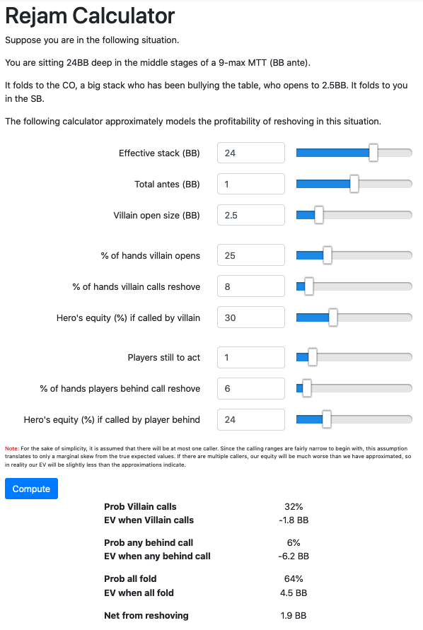

# poker-tools

Keywords: Flask, React, D3

## Setup

1. Clone this repo: `git clone https://github.com/josephcappadona/poker-site.git`
2. npm install
3. npm run dev
4. pip install -r requirements.txt
5. python server.py
6. Go to http://localhost:3000

## Screenshots

## References
* App structure based on https://github.com/rwieruch/minimal-react-webpack-babel-setup